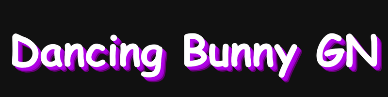

# Dancing Bunny Games Network

A lightweight browser-based games network with multiple launch methods, tab cloaking, bookmarklets, Data URI launching, favorites, search, and a multi-tab interface.

---

## Overview

Dancing Bunny Games Network is a fully client-side HTML application designed around portability and multiple launch methods.

The project includes:

* Multi-tab game interface
* Search system
* Favorites system
* Autoclicker
* Bookmarklet launcher
* NPM svg launcher
* New tab cloaking

The project currently contains access to over **2608 games**.

---

## Demo

# https://ltorl.github.io/dancing-bunny

---

## Launch Methods

---

### NPM svg

```text
https://cdn.jsdelivr.net/npm/db-gn@latest/index.svg
```

This probably wont be blocked because it would break real school sites

---

### HTML

Copy and run the HTML directly:

```text
https://raw.githubusercontent.com/ltorl/dancing-bunny/refs/heads/main/index.html
```

#### Instructions

1. Open the raw HTML file
2. Copy the source
3. Paste into:

   * CodeTester
   * W3Schools Tryit
   * Code.org Web Lab
   * OneCompiler
4. Run the page

---

### Bookmarklet

```text
https://raw.githubusercontent.com/ltorl/dancing-bunny/refs/heads/main/bookmarklet.js
```

#### Instructions

1. Open the bookmarklet source
2. Copy the code
3. Create a new bookmark
4. Paste the code into the bookmark URL field
5. Run from any webpage (ex: google.com)

---

## License

Licensed under the GNU General Public License v3.0.

---

